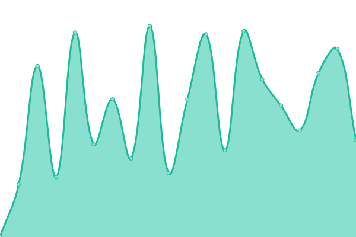
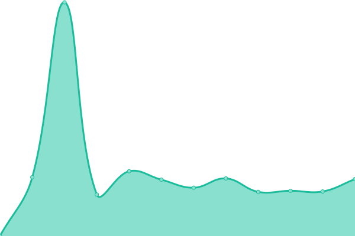

# [📈 Live Status](https://status.oncloud.at): <!--live status--> **🟧 Partial outage**

This repository contains the open-source uptime monitor and status page for [traktuner](https://status.oncloud.at), powered by [Upptime](https://github.com/upptime/upptime).

With [Upptime](https://upptime.js.org), you can get your own unlimited and free uptime monitor and status page, powered entirely by a GitHub repository. We use [Issues](https://github.com/traktuner/status/issues) as incident reports, [Actions](https://github.com/traktuner/status/actions) as uptime monitors, and [Pages](https://status.oncloud.at) for the status page.

<!--start: status pages-->
<!-- This summary is generated by Upptime (https://github.com/upptime/upptime) -->
<!-- Do not edit this manually, your changes will be overwritten -->
<!-- prettier-ignore -->
| URL | Status | History | Response Time | Uptime |
| --- | ------ | ------- | ------------- | ------ |
|  Anakin | 🟩 Up | [anakin.yml](https://github.com/traktuner/status/commits/HEAD/history/anakin.yml) | 

 587ms
     
 | 

<a href="https://status.oncloud.at/history/anakin">100.00%</a>
    

|  VMM | 🟩 Up | [vmm.yml](https://github.com/traktuner/status/commits/HEAD/history/vmm.yml) | 

 637ms
     
 | 

<a href="https://status.oncloud.at/history/vmm">100.00%</a>
    

|  ABB Backup | 🟥 Down | [abb-backup.yml](https://github.com/traktuner/status/commits/HEAD/history/abb-backup.yml) | 

 165ms
     
 | 

<a href="https://status.oncloud.at/history/abb-backup">100.00%</a>
    

|  ABB Restore | 🟩 Up | [abb-restore.yml](https://github.com/traktuner/status/commits/HEAD/history/abb-restore.yml) | 

 572ms
     
 | 

<a href="https://status.oncloud.at/history/abb-restore">100.00%</a>
    

|  Portainer | 🟩 Up | [portainer.yml](https://github.com/traktuner/status/commits/HEAD/history/portainer.yml) | 

 623ms
     
 | 

<a href="https://status.oncloud.at/history/portainer">100.00%</a>
    

|  Matrix Chat WebUI | 🟩 Up | [matrix-chat-web-ui.yml](https://github.com/traktuner/status/commits/HEAD/history/matrix-chat-web-ui.yml) | 

 510ms
     
 | 

<a href="https://status.oncloud.at/history/matrix-chat-web-ui">99.81%</a>
    

|  Matrix Chat Synapse Status | 🟩 Up | [matrix-chat-synapse-status.yml](https://github.com/traktuner/status/commits/HEAD/history/matrix-chat-synapse-status.yml) | 

 822ms
     
 | 

<a href="https://status.oncloud.at/history/matrix-chat-synapse-status">99.81%</a>
    

|  Matrix Federation Tester | 🟩 Up | [matrix-federation-tester.yml](https://github.com/traktuner/status/commits/HEAD/history/matrix-federation-tester.yml) | 

 422ms
     
 | 

<a href="https://status.oncloud.at/history/matrix-federation-tester">100.00%</a>
    

|  Bitwarden | 🟩 Up | [bitwarden.yml](https://github.com/traktuner/status/commits/HEAD/history/bitwarden.yml) | 

 471ms
     
 | 

<a href="https://status.oncloud.at/history/bitwarden">100.00%</a>
    

|  Mastodon | 🟩 Up | [mastodon.yml](https://github.com/traktuner/status/commits/HEAD/history/mastodon.yml) | 

 772ms
     
 | 

<a href="https://status.oncloud.at/history/mastodon">100.00%</a>
    

|  Jellyfin | 🟩 Up | [jellyfin.yml](https://github.com/traktuner/status/commits/HEAD/history/jellyfin.yml) | 

 663ms
     
 | 

<a href="https://status.oncloud.at/history/jellyfin">100.00%</a>
    

|  Drive | 🟩 Up | [drive.yml](https://github.com/traktuner/status/commits/HEAD/history/drive.yml) | 

 676ms
     
 | 

<a href="https://status.oncloud.at/history/drive">100.00%</a>
    

|  Optoingen-Web | 🟩 Up | [optoingen-web.yml](https://github.com/traktuner/status/commits/HEAD/history/optoingen-web.yml) | 

 828ms
     
 | 

<a href="https://status.oncloud.at/history/optoingen-web">100.00%</a>
    

|  Pferde-helfen-Menschen | 🟩 Up | [pferde-helfen-menschen.yml](https://github.com/traktuner/status/commits/HEAD/history/pferde-helfen-menschen.yml) | 

 621ms
     
 | 

<a href="https://status.oncloud.at/history/pferde-helfen-menschen">100.00%</a>
    

|  [Luke](https://langstadlingerbak.de4.quickconnect.to) | 🟩 Up | [luke.yml](https://github.com/traktuner/status/commits/HEAD/history/luke.yml) | 

 698ms
     
 | 

<a href="https://status.oncloud.at/history/luke">100.00%</a>
    

|  Baumschule Frank | 🟩 Up | [baumschule-frank.yml](https://github.com/traktuner/status/commits/HEAD/history/baumschule-frank.yml) | 

 1665ms
     
 | 

<a href="https://status.oncloud.at/history/baumschule-frank">100.00%</a>
    

<!--end: status pages-->

[**Visit our status website →**](https://status.oncloud.at)

## 📄 License

- Powered by: [Upptime](https://github.com/upptime/upptime)
- Code: [MIT](./LICENSE) © [traktuner](https://status.oncloud.at)
- Data in the `./history` directory: [Open Database License](https://opendatacommons.org/licenses/odbl/1-0/)
