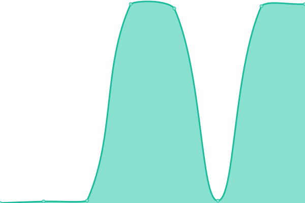
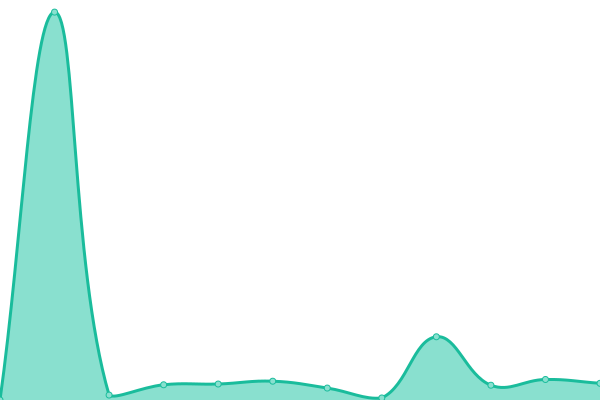

# [📈 Live Status](https://status.oncloud.at): <!--live status--> **🟧 Partial outage**

This repository contains the open-source uptime monitor and status page for [traktuner](https://status.oncloud.at), powered by [Upptime](https://github.com/upptime/upptime).

With [Upptime](https://upptime.js.org), you can get your own unlimited and free uptime monitor and status page, powered entirely by a GitHub repository. We use [Issues](https://github.com/traktuner/status/issues) as incident reports, [Actions](https://github.com/traktuner/status/actions) as uptime monitors, and [Pages](https://status.oncloud.at) for the status page.

<!--start: status pages-->
<!-- This summary is generated by Upptime (https://github.com/upptime/upptime) -->
<!-- Do not edit this manually, your changes will be overwritten -->
<!-- prettier-ignore -->
| URL | Status | History | Response Time | Uptime |
| --- | ------ | ------- | ------------- | ------ |
|  Anakin | 🟩 Up | [anakin.yml](https://github.com/traktuner/status/commits/HEAD/history/anakin.yml) | 

 718ms
     
 | 

<a href="https://status.oncloud.at/history/anakin">100.00%</a>
    

|  VMM | 🟩 Up | [vmm.yml](https://github.com/traktuner/status/commits/HEAD/history/vmm.yml) | 

 636ms
     
 | 

<a href="https://status.oncloud.at/history/vmm">100.00%</a>
    

|  ABB Backup | 🟩 Up | [abb-backup.yml](https://github.com/traktuner/status/commits/HEAD/history/abb-backup.yml) | 

 159ms
     
 | 

<a href="https://status.oncloud.at/history/abb-backup">100.00%</a>
    

|  ABB Restore | 🟩 Up | [abb-restore.yml](https://github.com/traktuner/status/commits/HEAD/history/abb-restore.yml) | 

 571ms
     
 | 

<a href="https://status.oncloud.at/history/abb-restore">100.00%</a>
    

|  Portainer | 🟩 Up | [portainer.yml](https://github.com/traktuner/status/commits/HEAD/history/portainer.yml) | 

 632ms
     
 | 

<a href="https://status.oncloud.at/history/portainer">100.00%</a>
    

|  Bitwarden | 🟩 Up | [bitwarden.yml](https://github.com/traktuner/status/commits/HEAD/history/bitwarden.yml) | 

 541ms
     
 | 

<a href="https://status.oncloud.at/history/bitwarden">100.00%</a>
    

|  Mastodon | 🟩 Up | [mastodon.yml](https://github.com/traktuner/status/commits/HEAD/history/mastodon.yml) | 

 741ms
     
 | 

<a href="https://status.oncloud.at/history/mastodon">100.00%</a>
    

|  Drive | 🟩 Up | [drive.yml](https://github.com/traktuner/status/commits/HEAD/history/drive.yml) | 

 809ms
     
 | 

<a href="https://status.oncloud.at/history/drive">0.00%</a>
    

|  Nextcloud | 🟥 Down | [nextcloud.yml](https://github.com/traktuner/status/commits/HEAD/history/nextcloud.yml) | 

 9062ms
     
 | 

<a href="https://status.oncloud.at/history/nextcloud">0.00%</a>
    

|  Maubot | 🟩 Up | [maubot.yml](https://github.com/traktuner/status/commits/HEAD/history/maubot.yml) | 

 1135ms
     
 | 

<a href="https://status.oncloud.at/history/maubot">0.00%</a>
    

|  Optoingen-Web | 🟩 Up | [optoingen-web.yml](https://github.com/traktuner/status/commits/HEAD/history/optoingen-web.yml) | 

 663ms
     
 | 

<a href="https://status.oncloud.at/history/optoingen-web">92.45%</a>
    

|  Pferde-helfen-Menschen | 🟩 Up | [pferde-helfen-menschen.yml](https://github.com/traktuner/status/commits/HEAD/history/pferde-helfen-menschen.yml) | 

 257ms
     
 | 

<a href="https://status.oncloud.at/history/pferde-helfen-menschen">100.00%</a>
    

|  [Luke](https://langstadlingerbak.de4.quickconnect.to) | 🟩 Up | [luke.yml](https://github.com/traktuner/status/commits/HEAD/history/luke.yml) | 

 625ms
     
 | 

<a href="https://status.oncloud.at/history/luke">100.00%</a>
    

|  Baumschule Frank | 🟩 Up | [baumschule-frank.yml](https://github.com/traktuner/status/commits/HEAD/history/baumschule-frank.yml) | 

 1704ms
     
 | 

<a href="https://status.oncloud.at/history/baumschule-frank">100.00%</a>
    

<!--end: status pages-->

[**Visit our status website →**](https://status.oncloud.at)

## 📄 License

- Powered by: [Upptime](https://github.com/upptime/upptime)
- Code: [MIT](./LICENSE) © [traktuner](https://status.oncloud.at)
- Data in the `./history` directory: [Open Database License](https://opendatacommons.org/licenses/odbl/1-0/)
