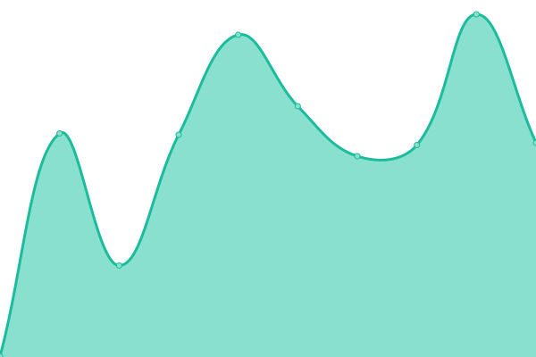

# [📈 Live Status](https://status.langstadlinger.eu): <!--live status--> **🟩 All systems operational**

This repository contains the open-source uptime monitor and status page for [traktuner](https://status.langstadlinger.eu), powered by [Upptime](https://github.com/upptime/upptime).

With [Upptime](https://upptime.js.org), you can get your own unlimited and free uptime monitor and status page, powered entirely by a GitHub repository. We use [Issues](https://github.com/traktuner/status/issues) as incident reports, [Actions](https://github.com/traktuner/status/actions) as uptime monitors, and [Pages](https://status.langstadlinger.eu) for the status page.

<!--start: status pages-->
<!-- This summary is generated by Upptime (https://github.com/upptime/upptime) -->
<!-- Do not edit this manually, your changes will be overwritten -->
<!-- prettier-ignore -->
| URL | Status | History | Response Time | Uptime |
| --- | ------ | ------- | ------------- | ------ |
|  [Anakin](https://anakin.langstadlinger.eu) | 🟩 Up | [anakin.yml](https://github.com/traktuner/status/commits/HEAD/history/anakin.yml) | 

 613ms
     
 | 

<a href="https://status.langstadlinger.eu/history/anakin">99.22%</a>
    

|  [VMM](https://vmm.langstadlinger.eu) | 🟩 Up | [vmm.yml](https://github.com/traktuner/status/commits/HEAD/history/vmm.yml) | 

 738ms
     
 | 

<a href="https://status.langstadlinger.eu/history/vmm">99.23%</a>
    

|  [ABB Backup](backup.langstadlinger.eu) | 🟩 Up | [abb-backup.yml](https://github.com/traktuner/status/commits/HEAD/history/abb-backup.yml) | 

 147ms
     
 | 

<a href="https://status.langstadlinger.eu/history/abb-backup">100.00%</a>
    

|  [ABB Restore](https://backup.langstadlinger.eu) | 🟩 Up | [abb-restore.yml](https://github.com/traktuner/status/commits/HEAD/history/abb-restore.yml) | 

 513ms
     
 | 

<a href="https://status.langstadlinger.eu/history/abb-restore">99.24%</a>
    

|  [Portainer](https://prt-prod.langstadlinger.eu) | 🟩 Up | [portainer.yml](https://github.com/traktuner/status/commits/HEAD/history/portainer.yml) | 

 551ms
     
 | 

<a href="https://status.langstadlinger.eu/history/portainer">99.26%</a>
    

|  [Matrix Chat WebUI](https://chat.langstadlinger.eu) | 🟩 Up | [matrix-chat-web-ui.yml](https://github.com/traktuner/status/commits/HEAD/history/matrix-chat-web-ui.yml) | 

 520ms
     
 | 

<a href="https://status.langstadlinger.eu/history/matrix-chat-web-ui">99.27%</a>
    

|  [Matrix Chat Synapse Status](https://synapse.langstadlinger.eu) | 🟩 Up | [matrix-chat-synapse-status.yml](https://github.com/traktuner/status/commits/HEAD/history/matrix-chat-synapse-status.yml) | 

 738ms
     
 | 

<a href="https://status.langstadlinger.eu/history/matrix-chat-synapse-status">99.30%</a>
    

|  [Matrix Chat API](https://matrix.langstadlinger.eu/googlechat/login/) | 🟩 Up | [matrix-chat-api.yml](https://github.com/traktuner/status/commits/HEAD/history/matrix-chat-api.yml) | 

 522ms
     
 | 

<a href="https://status.langstadlinger.eu/history/matrix-chat-api">99.32%</a>
    

|  [Bitwarden](https://pw.langstadlinger.eu) | 🟩 Up | [bitwarden.yml](https://github.com/traktuner/status/commits/HEAD/history/bitwarden.yml) | 

 467ms
     
 | 

<a href="https://status.langstadlinger.eu/history/bitwarden">99.33%</a>
    

|  [Zabbix](https://zbx.langstadlinger.eu) | 🟩 Up | [zabbix.yml](https://github.com/traktuner/status/commits/HEAD/history/zabbix.yml) | 

 516ms
     
 | 

<a href="https://status.langstadlinger.eu/history/zabbix">99.35%</a>
    

|  [Optoingen-Web](https://optoingen.com) | 🟩 Up | [optoingen-web.yml](https://github.com/traktuner/status/commits/HEAD/history/optoingen-web.yml) | 

 1700ms
     
 | 

<a href="https://status.langstadlinger.eu/history/optoingen-web">99.36%</a>
    

|  [Pferde-helfen-Menschen](https://pferde-helfen-menschen.at) | 🟩 Up | [pferde-helfen-menschen.yml](https://github.com/traktuner/status/commits/HEAD/history/pferde-helfen-menschen.yml) | 

 1416ms
     
 | 

<a href="https://status.langstadlinger.eu/history/pferde-helfen-menschen">99.38%</a>
    

|  [Luke](https://langstadlingerbak.de4.quickconnect.to) | 🟩 Up | [luke.yml](https://github.com/traktuner/status/commits/HEAD/history/luke.yml) | 

 567ms
     
 | 

<a href="https://status.langstadlinger.eu/history/luke">100.00%</a>
    

|  [Baumschule Frank](https://baumschule-frank.com) | 🟩 Up | [baumschule-frank.yml](https://github.com/traktuner/status/commits/HEAD/history/baumschule-frank.yml) | 

 1626ms
     
 | 

<a href="https://status.langstadlinger.eu/history/baumschule-frank">100.00%</a>
    

<!--end: status pages-->

[**Visit our status website →**](https://status.langstadlinger.eu)

## 📄 License

- Powered by: [Upptime](https://github.com/upptime/upptime)
- Code: [MIT](./LICENSE) © [traktuner](https://status.langstadlinger.eu)
- Data in the `./history` directory: [Open Database License](https://opendatacommons.org/licenses/odbl/1-0/)
